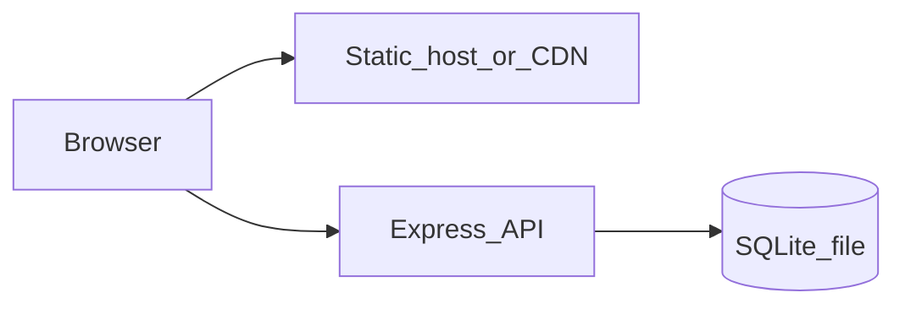

# Production deployment guide

This document describes how to deploy the **Budget Limousine** stack in production: a **Vite-built SPA** (static assets) and a **Node.js Express API** with **SQLite**. The API does **not** serve the frontend; you combine them with a reverse proxy, a CDN, or separate hosts.

**Scope:** The repository does not include Docker images or CI workflows. The patterns below apply to a typical Linux VPS with Nginx (or similar). You can containerize later using the same environment variables and build commands.

## Architecture options

### Option A — Single host, Nginx + Node (common)

- Nginx serves `dist/` for `/` (and client-side routes via `try_files`).
- Nginx proxies `/api` and `/health` to the Node process on an internal port.
- One public hostname and TLS certificate; simplest CORS story if the browser only talks to that hostname (same-origin API paths).

### Option B — Split hosting

- **Static frontend:** CDN or object storage + CDN (e.g. `https://app.example.com`).
- **API:** Separate origin (e.g. `https://api.example.com`).
- Set `VITE_API_URL` to the **public API origin** when building the frontend.
- Set backend `CORS_ORIGIN` to the exact frontend origin(s), comma-separated, **no** `*` in production.



## Build-time vs runtime configuration

| Concern | Notes |
|---------|--------|
| **Vite `VITE_*` variables** | Injected when you run `npm run build` on the frontend. Changing the API URL or Maps key requires a **new build**. Do not expect to swap them with server-only env vars on the static host. |
| **Backend `.env`** | Read at process startup (`dotenv`). Use real secrets from environment or a secrets manager on the server; avoid committing `.env`. |
| **Public Maps key** | `VITE_GOOGLE_MAPS_API_KEY` is visible in the browser bundle. Restrict it in Google Cloud (HTTP referrers for your production domain). |

## Production environment variables

### Frontend (build machine or CI)

Set these **before** `npm run build` (e.g. in CI secrets or a `.env.production` file that is not committed).

| Variable | Production guidance |
|----------|---------------------|
| `VITE_API_URL` | Public base URL of the API **without** trailing slash. Same origin as the site if Nginx proxies `/api` to Node (e.g. `https://www.example.com`). Or `https://api.example.com` if the API is on another host. |
| `VITE_GOOGLE_MAPS_API_KEY` | Restrict by HTTP referrer to your production domain(s). |

### Backend (runtime on the server)

Align with `backend/.env.example` names:

| Variable | Production guidance |
|----------|---------------------|
| `PORT` | Internal listen port if behind Nginx (e.g. `3001`). |
| `NODE_ENV` | `production`. |
| `DB_PATH` | Absolute path on persistent disk (e.g. `/var/lib/limo/limo.db`). Ensure the process user can read/write the file and directory. |
| `JWT_SECRET` | Long cryptographically random string (e.g. 32+ bytes). Store in a secrets manager or restricted env; rotate with a migration plan for existing tokens. |
| `CORS_ORIGIN` | Exact allowed frontend origins, comma-separated, no spaces (e.g. `https://www.example.com,https://example.com`). Do **not** use `*` in production. |
| `ADMIN_USERNAME` / `ADMIN_PASSWORD` | Run `npm run seed` once on first deploy (or when intentionally resetting the admin). Use a strong password; treat seed like a migration step, not a daily command. |

## Deployment steps (summary)

1. **Server:** Install Node.js (LTS), Nginx (or your proxy), and process manager (systemd, PM2, etc.).
2. **Backend:** Copy `backend/` to the server, run `npm ci` (or `npm install --omit=dev` after a clean `npm run build` locally), `npm run build`, set env vars, ensure `DB_PATH` directory exists, run `npm run seed` once if needed, start with `npm start` (runs `node dist/server.js`).
3. **Frontend:** On a build host or CI, set `VITE_*`, run `npm ci` and `npm run build`, upload `dist/` to the static root Nginx serves (or to your CDN).
4. **TLS:** Terminate HTTPS at Nginx (Let’s Encrypt or managed certificates).
5. **Verify:** `curl https://your-domain/health` (or via internal proxy path if you expose `/health` publicly).

## Nginx example (Option A: same host)

Illustrative configuration — adjust paths, domain, and upstream port.

```nginx
server {
    listen 443 ssl http2;
    server_name www.example.com;

    # ssl_certificate ...;
    # ssl_certificate_key ...;

    root /var/www/limo/dist;
    index index.html;

    gzip on;
    gzip_types text/css application/javascript application/json image/svg+xml;

    location /api/ {
        proxy_pass http://127.0.0.1:3001;
        proxy_http_version 1.1;
        proxy_set_header Host $host;
        proxy_set_header X-Real-IP $remote_addr;
        proxy_set_header X-Forwarded-For $proxy_add_x_forwarded_for;
        proxy_set_header X-Forwarded-Proto $scheme;
    }

    location /health {
        proxy_pass http://127.0.0.1:3001;
        proxy_http_version 1.1;
        proxy_set_header Host $host;
    }

    location / {
        try_files $uri $uri/ /index.html;
    }
}
```

If the API is mounted only under `/api`, set `VITE_API_URL` to `https://www.example.com` and ensure your frontend client calls paths like `/api/...` relative to that origin (as this project does when given a base URL without path prefix). If your API is on another subdomain, `VITE_API_URL` must be that full origin.

**Helmet and duplicate headers:** The app uses [Helmet](https://github.com/helmetjs/helmet). Nginx can also set security headers. Avoid sending conflicting or duplicate `Content-Security-Policy` values; prefer one layer to own CSP or align policies carefully.

## Security best practices

1. **HTTPS only** — Redirect HTTP to HTTPS; HSTS once stable.
2. **Secrets** — Never commit production `.env`. Use OS env, systemd `EnvironmentFile`, or a cloud secrets manager.
3. **JWT** — Strong `JWT_SECRET`; short-lived access tokens if you extend the auth model later.
4. **Admin account** — Strong password; limit who can run `seed`; consider IP allowlisting or VPN for `/admin` at the proxy layer.
5. **CORS** — Explicit origin list matching your real frontend URLs.
6. **Google Maps key** — Referrer restrictions; monitor usage and quotas in Google Cloud.
7. **Rate limiting** — The API already applies `express-rate-limit` on booking and auth routes. If Nginx strips client IPs, ensure the app sees the real client IP (see **Trust proxy** below).

## Trust proxy (behind Nginx or a load balancer)

Express rate limiting and logging often rely on the client IP. When all requests appear to come from `127.0.0.1`, limits apply to **all** users together.

If you deploy behind a reverse proxy, you may need to enable trust for the proxy hop, for example in application code:

```ts
app.set('trust proxy', 1);
```

The repository does not set this by default. Evaluate your deployment and add it only if you understand the security implications (trust only your proxy IPs).

## SQLite operations

- **Persistence:** Put `DB_PATH` on a volume that survives redeploys and backups.
- **Backups:** Stop the app or use a filesystem snapshot / copy workflow; SQLite is a single file but avoid copying while writes are active without a safe backup strategy.
- **Concurrency:** SQLite suits a single Node instance writing to one database file. Multiple write-heavy instances require architectural changes (e.g. PostgreSQL).

## Observability and maintenance

- **Health checks:** Use `GET /health` for uptime monitors and load balancer probes.
- **Logs:** Capture stdout/stderr from the Node process; rotate logs on the host.
- **Updates:** Periodically update dependencies; run `npm audit` in root and `backend/`; test in staging before production.
- **Process supervision:** Use systemd or PM2 so the API restarts on failure and after reboot.

## Checklist before go-live

- [ ] `NODE_ENV=production` for the API process.
- [ ] Strong `JWT_SECRET` and admin password; production `CORS_ORIGIN` list set.
- [ ] Frontend built with production `VITE_API_URL` and restricted Maps key.
- [ ] TLS enabled; no production secrets in git.
- [ ] SQLite path on durable storage; backup procedure documented.
- [ ] `/health` monitored; optional alerting on 5xx rates.

For local development, see [SETUP_DEVELOPMENT.md](./SETUP_DEVELOPMENT.md).
